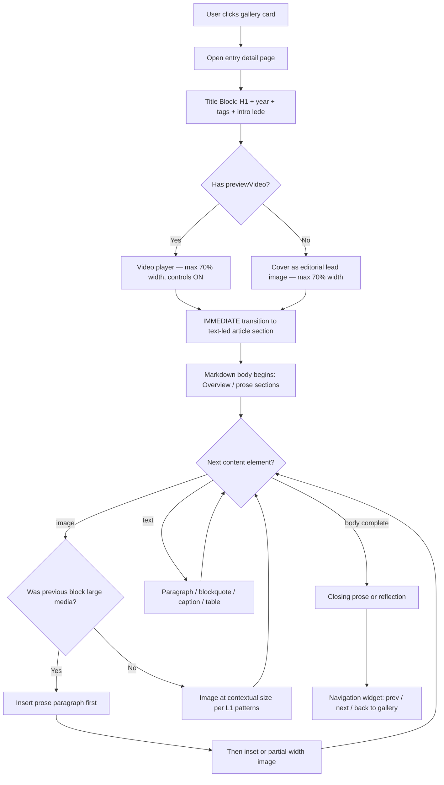
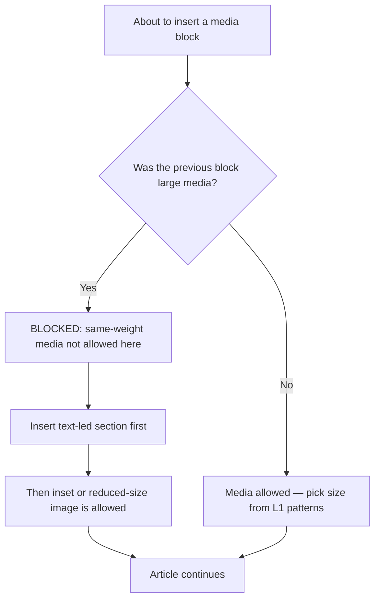

# Yuzuru Hanyu Visual Diary — Markdown → Modern HTML Render

## 1) Project Summary
This repository demonstrates **Decouple Content and Rendering** by keeping content in Markdown (`content.md`, `entries/*.md`) and rendering it into a modern gallery website (HTML) using open-source tooling.

- **Content source**: `content.md` + `entries/*.md`
- **Assets**: `assets/images/*` + optional `assets/previews/*`
- **Rendered output**: `output/` (committed)

## 2) Tool Choice (Open Source) + Why
- **Astro**: static site generation + routing; great for content-driven sites
- **React islands**: hover preview popover behavior (video play/pause, positioning)
- **CSS**: masonry collage layout, rounded cards, elegant typography, chips

This combination keeps content separate from presentation, and produces a professional-looking HTML output.

## 3) Environment Requirements
- OS: Linux / macOS recommended
- Node.js: 18+ (or 20+)
- npm available

## 3.5) Bootstrap Check — IMPORTANT FOR AI AGENTS

Before running any commands, check whether the source code already exists in this repository:

**Case A — `src/` and `package.json` are present (normal clone):**
> Proceed directly to Step 4. The Skill Spec has already been implemented.
> Do NOT regenerate or overwrite `src/`.

**Case B — `src/` or `package.json` are missing:**
> The AI agent must scaffold the Astro + React project from scratch using the Skill Spec (MODULE A–K, below) before installing or building.
> Steps:
> 1. Read all MODULE sections in this README
> 2. Generate `src/pages/index.astro`, `src/pages/[slug]/index.astro`, `src/components/GalleryCard.jsx`, `src/layouts/Layout.astro`
> 3. Generate `package.json` with `astro`, `@astrojs/react`, `react`, `react-dom` as dependencies
> 4. Then continue with Step 4 (Install) below

> **In both cases:** `content.md`, `entries/*.md`, and `assets/` are the content source — never modify them during rendering.

## 4) Install
```bash
npm install
````

If dependencies are missing:

```bash
npm install astro @astrojs/react react react-dom
```

## 5) Run / Render

### Dev preview

```bash
npm run dev
```

### Build

```bash
npm run build
```

### Export to output/

If Astro outputs to `dist/`, export like this:

```bash
rm -rf output/*
cp -r dist/* output/
# Make a single-file entry for graders (safe):
cp output/index.html output/output.html
```

## 6) Expected Output

At minimum, `output/` must contain at least one directly viewable artifact:

* `output/output.html` (main entry for grading)
* plus the full site folder/files (e.g., `output/index.html`, `output/<slug>/index.html`, assets)

## 7) References

- Astro Docs: https://docs.astro.build/
- Astro Routing: https://docs.astro.build/en/core-concepts/routing/
- Astro + React Integration: https://docs.astro.build/en/guides/integrations-guide/react/
- React Docs: https://react.dev/
- MDN `<video>` element (autoplay/muted/loop behavior): https://developer.mozilla.org/en-US/docs/Web/HTML/Element/video
- MDN `object-fit` / `object-position` (cropping control): https://developer.mozilla.org/en-US/docs/Web/CSS/object-fit

---

# Skill Spec (Modular SDD for the AI Agent)

## 0) Document Role

This `README.md` is the **single source of rendering truth** (skill/spec for the agent).
It defines how to transform Markdown + assets into a modern gallery website while keeping content and presentation decoupled.

---

# MODULE A — Feature Switchboard (Edit here to add/remove features)

## A1) Feature Flags

* Gallery layout: `masonry_collage` (ON)
* Hover interaction: `popover_preview` (ON)
* Flip-card: `OFF`
* Detail pages: `ON`
* Tag chips: `ON`
* Tag filters / search: `OFF` (optional future)
* Music embed on detail pages: `OPTIONAL` (future)

## A2) Hover Preview Requirements (popover_preview)

Desktop hover:

* show floating preview popover anchored near hovered card
* left: title + year + short intro + (optional tag chips) + CTA
* right: preview media (video preferred, else poster, else cover)
* card remains clickable; popover click also navigates to detail page

Mobile/touch:

* disable popover preview
* clicking navigates normally

---

# MODULE B — Repository Contract (Inputs/Outputs)

## B1) Inputs

Required:

* `content.md`
* `entries/*.md`
* `assets/images/*`

Optional:

* `assets/previews/*` (short videos)

## B2) Output

* `output/index.html` (site entry)
* `output/<slug>/index.html` (detail pages)
* `output/output.html` (single-file entry for grading)
* all assets copied so images/videos load

---

# MODULE C — Content Schema (Frontmatter contract)

## C1) `content.md` (Manifest)

`content.md` contains:

* gallery title/description
* list of entry paths under `## Gallery Entries`
  Agent must read `content.md` first.

## C2) Entry File Contract (`entries/*.md`)

Required:

* `title`, `slug`, `year`, `cover`, `images`, `intro`, `size`, `order`

Optional:

* `previewVideo` (assets/previews)
* `previewPoster` (defaults to cover)
* `coverPosition` (CSS object-position)
* `tags` (1–6)

Body = full diary content for detail page.

---

# MODULE D — Input Discovery & Validation

## D1) Discovery Order

1. Read `content.md`
2. Parse `## Gallery Entries`
3. Load each entry md
4. Extract frontmatter + body
5. Validate:

   * entry exists
   * cover exists
   * images[] exist
   * if previewVideo exists → file exists
   * if previewPoster exists → file exists
   * tags, if present, is list of strings

Do not fail if `previewPoster` is missing (fallback to cover).

## D2) Asset Mapping Rule

Source:

* `assets/images` → public `/images`
* `assets/previews` → public `/previews`

---

# MODULE E — Page Model

## E1) Gallery Index (`/`)

* masonry collage
* mixed card sizes (`size`)
* rounded corners
* title/year overlay
* hover popover preview
* click navigates

## E2) Detail Page (`/<slug>/`) — Editorial Article Layout

Each entry renders as an **artistic editorial article**, not a slideshow, image stack, or generic blog post.
Apply the Composition Grammar defined in MODULE L strictly.

### Fixed Section Order

**1. Title Block**
- H1 title (large serif display font)
- Year + category line
- Tag chips row (if tags exist)
- Intro teaser (frontmatter `intro`) as short lead paragraph — styled as a lede, not a caption

**2. Lead Media Section** (choose ONE — never both)
- If `previewVideo` exists: render video player
  - autoplay: OFF
  - muted: OFF
  - controls: ON
  - poster: `previewPoster` fallback to `cover`
  - Width: max 70% of page width, centered — NOT full-bleed
- Else: render `cover` as editorial lead image
  - Width: max 70%, centered or editorially offset
  - Treat as a composed image, not a banner

> **CRITICAL:** After the lead media, the NEXT section must be text. Do NOT place another image or video immediately after the lead media. Transition to prose first.

**3. Article Body** (text-led, images integrated into prose)
- Render the full entry markdown body
- Preserve all headings, blockquotes, lists, tables
- Distribute `images[]` throughout the body using the inline/wrapped/inset patterns from MODULE L
- Do NOT collect images into a separate gallery section
- Do NOT render a standalone "photo grid" at any point

**4. Navigation Widget**
- Prev / Next entry links (with title + small cover thumbnail)
- Back to gallery index link
- Style: subtle, editorial footer widget — not a full nav bar

---

# MODULE L — Detail Page Composition Grammar

## L1) Allowed Composition Patterns

Use these patterns to arrange content inside the Article Body (Section 3 of E2):

| Pattern | Description |
|---|---|
| Inset image left/right | Image floated left or right, ~35–45% width; text wraps around it |
| Prose-width image | Image centered at max 65% width; text above and below |
| Pull quote | Styled blockquote, full prose width, no adjacent image |
| Caption + small image | Image at ~30% width with caption beside or beneath it |
| Side-by-side pair | Two images at ~45% each with shared caption below |
| Text → image → text | Prose section, then a composed image, then prose continues |

## L2) DISALLOWED Patterns (enforce strictly)

The following patterns are **prohibited** and must never appear:

- Two or more full-width (>70% width) media blocks appearing consecutively without intervening prose
- A video block followed immediately by another image at the same visual weight or width
- Three or more images stacked vertically at the same width in sequence
- A standalone "photo gallery grid" section separate from the article body
- A cinematic or fullscreen hero/banner block before the Title Block
- Any pattern where media dominates and text is deferred to the end

## L3) Composition Flow — Detail Page



## L4) Composition Guard — Media Sequencing Rule



## L5) Image Distribution Rule

When `images[]` contains multiple images:
- Distribute them throughout the article body, not collected at the end
- Assign each image a layout role from L1 (inset, prose-width, side-by-side, etc.)
- Alternate layout roles to create visual rhythm — do not repeat the same pattern consecutively
- If only one image is available, treat it as a prose-width inset within the body

---

# MODULE F — Visual Style System

## F1) Aesthetic Targets

Elegant, curated:

* dark/muted background
* refined typography
* generous spacing
* soft overlays
* minimal UI

Avoid neon, heavy glass, noisy gradients.

## F2) Tokens

* radius: large
* spacing scale: 8/12/16/24/32
* overlay gradient for legibility
* subtle hover lift

## F3) Cropping Safety

Card image:

* object-fit: cover
* object-position: `coverPosition` if present else `50% 35%`

## F4) Detail Page Typography (premium editorial feel)
- Hero title: large serif display (or existing display font)
- Body text: clean sans-serif, readable line length
- Use generous vertical spacing between sections
- Limit body width (avoid full-width paragraphs)

---

# MODULE G — Interaction: Hover Preview Popover

## G1) Trigger Rules

Desktop:

* open after 150–250ms
* close after 150–250ms
* Esc closes
  Mobile: disabled.

## G2) Popover Layout

Left:

* title, year, up to 5 tag chips, intro (2–4 lines), CTA
  Right media fallback order (strict):

1. `previewVideo` (autoplay muted loop)
2. `previewPoster`
3. `cover`

- Include an Unmute/Mute toggle near the media area.
- The toggle must be clickable and keyboard accessible.

## G3) Navigation Rule

Card click and popover click both navigate to `/<slug>/`.

## G4) Video Rules (hover popover)

Goal: hover previews should start immediately and be consistent across browsers.

Default behavior (must be reliable):
- autoplay: ON (hover only)
- muted: ON by default (browser-safe)
- loop: ON
- controls: OFF
- preload: metadata
- show poster instantly before video starts

Audio policy (browser-safe):
- Provide an "Unmute" control in the popover.
- Only unmute after a user gesture (click on the Unmute button).
- Remember the user's choice for the session (if unmuted once, future hover previews may start unmuted).
- If unmute is not permitted by the browser, keep playing muted (do not break playback).

If video fails → fall back to poster/cover.

---

# MODULE H — Tag System (chips)

## H1) Entry Tags Schema

`tags: ["Worlds", "FS", "Lyrical"]`

* short strings
* 1–6 tags
* consistent capitalization

## H2) Chip Rendering

* render as pill chips
* popover: up to 5
* detail page: all (wrap)

## H3) Optional Tag Filtering (future)

If enabled:

* filter bar on gallery
* “All” chip
* click filters visible cards

---

# MODULE I — Implementation Boundaries (Astro vs React)

Astro:

* routing, markdown loading, static generation

React islands:

* hover state management
* popover positioning + video play/pause
* optional filter UI state

No full SPA.

---

# MODULE J — Build & Export Commands

```bash
npm install
npm run dev
npm run build
rm -rf output/*
cp -r dist/* output/
cp output/index.html output/output.html
```

---

# MODULE K — Success Checklist (AI-graded)

Must:

* Pinterest-style mixed-size collage
* premium aesthetic
* hover preview popover
* strict fallback: video → poster → cover
* click navigates from card + popover
* detail pages render images + markdown body
* tag chips appear
* reproducible build steps
* Hover preview video autoplays reliably (muted by default)
* Unmute works after user clicks the Unmute control
* Detail pages follow the editorial section order: Title Block → Lead Media (max 70% width) → Article Body → Navigation Widget
* Detail pages render the preview video with controls (if previewVideo exists) and allow sound on user play
* After the lead media, the next rendered block is always text — never another image or video
* Images from `images[]` are distributed inside the article body using MODULE L composition patterns — never in a standalone gallery section
* No two full-width (>70%) media blocks appear consecutively anywhere in a detail page
* Each detail page ends with a prev/next/back navigation widget
---